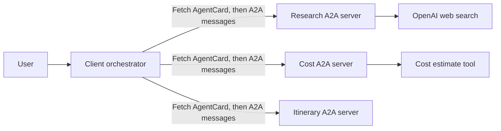

# A2A Travel Planning Agents

A local multi-agent travel planner demonstrating the Agent2Agent (A2A) protocol with LangChain and OpenAI. The client discovers specialist agents through their AgentCards and communicates with them over A2A instead of importing or calling their implementation code directly.

## What A2A Is

A2A is an interoperability protocol for agents to discover one another and exchange requests and results. It defines a common way to advertise an agent's capabilities and communicate with it, while leaving the agent free to use its own framework, tools, language, and internal workflow.

This separation matters as agent systems grow: a coordinator can delegate work to independently developed or deployed agents without knowing their internal implementation. Teams can change or replace an agent behind its A2A interface, and other agents can continue using the same published capabilities and protocol. A2A complements tool-calling protocols: tools expose functions an agent can use, while A2A connects agents that can perform tasks and return results.

## How LangChain Relates to A2A

LangChain and A2A solve different problems and work together in this project:

- **LangChain builds and runs the agents.** Each specialist uses LangChain's `create_agent` with its own model, prompt, and tools. The Research Agent has web search, the Cost Agent has a trip-cost tool, and the Itinerary Agent composes the supplied information.
- **A2A connects the separately running agents.** Each server wraps its LangChain agent in an A2A `AgentExecutor`. The executor turns an incoming A2A message into a LangChain invocation and returns the agent's answer as an A2A response.
- **LangChain also powers the client orchestrator.** The client exposes `ask_remote_agent` as a LangChain tool. When the orchestrator chooses a specialist, that tool uses the agent's card and the A2A client to send the request to its server.

In short, LangChain is used inside the agents and to make orchestration decisions; A2A is the shared discovery and communication boundary between processes. A remote agent could use a different framework internally and still participate, provided it implements the A2A interface advertised by its card.

## A2A and AI Scalability

A2A contributes to scalability by making agents independent units of capability with a shared communication contract. This helps an AI system grow in several dimensions:

- **Scale a busy capability independently:** deploy more instances of a heavily used agent, such as research, without scaling every other agent at the same rate.
- **Add specialists incrementally:** introduce a new agent for another domain and advertise its skills, rather than putting every responsibility into one increasingly complex agent.
- **Evolve components independently:** teams can update an agent's model, framework, tools, or hosting while keeping its A2A interface compatible.
- **Distribute work across teams and services:** agents can run as separate services and be owned by different teams or providers, instead of sharing one process and codebase.
- **Enable capability-based selection:** an orchestrator can use card metadata to identify agents suited to a task, instead of depending only on implementation-specific names.

A2A is an enabler, not an autoscaler or load balancer. Production systems still need infrastructure to run and scale replicas, a registry or service-discovery mechanism to locate them, and application policies for routing, concurrency, retries, timeouts, authentication, and monitoring. AgentCards describe an agent and its endpoint; they do not themselves distribute traffic across replicas.

In this demo, the research and cost work are logically independent, but the client asks the model to call them in sequence and the endpoints are statically listed in `ClientAgent.py`. A larger system could run independent calls concurrently and route through a registry or load balancer. The protocol provides the communication boundary for that growth; the orchestration and hosting layers implement it.

## Why AgentCards Matter

An AgentCard is an agent's machine-readable capability and connection description. It lets a client inspect what an agent offers before sending it a request. A card commonly describes:

- **Identity:** name, description, and version.
- **Connection:** the agent's A2A endpoint URL and supported input/output modes.
- **Capabilities:** protocol features such as streaming.
- **Skills:** stable skill IDs, names, descriptions, tags, and example requests.

In this project, each server publishes its card at `/.well-known/agent-card.json`. The client uses `A2ACardResolver` to fetch each card and `A2AClient` to send requests using the discovered card. It records cards under stable IDs and uses their descriptions to build its orchestration context. This separates agent identity and advertised capabilities from each agent's Python classes and internal tools.

AgentCards are metadata, not an authorization system or a complete agent registry. The client still needs a way to find an initial card URL. This sample uses the static `AGENT_ENDPOINTS` mapping in `ClientAgent.py` as that bootstrap list; a production system could obtain these URLs from configuration, a registry, or service discovery, then use cards to inspect and contact the agents.

## How A2A Works in This Example

1. Start the three independent A2A servers. Each server publishes an AgentCard and accepts A2A requests on its own port.
2. The client fetches the cards from the configured URLs and records which agent is available at each address.
3. For a trip request, the client orchestrator sends an A2A message to the Research Agent and Cost Agent.
4. Each server passes the incoming message to its local `AgentExecutor`. The executor invokes its agent and returns the response through the A2A server; the client does not call the agent's local Python function directly.
5. The client sends the original request plus the research and cost results to the Itinerary Agent, then returns its response to the user.

The A2A protocol handles communication across the agent boundary. The client-side orchestrator decides which agents to call and in what order; that workflow is application logic, not something AgentCards enforce.

## Architecture



The A2A boundary lets each server hide its framework, prompts, and tools. The card advertises the public-facing interface; the executor connects that interface to the agent's private implementation.

| Agent | Port | Responsibility |
| --- | ---: | --- |
| Research Agent | 9996 | Finds practical destination and activity information using web search. |
| Cost Agent | 9997 | Estimates lodging, food, local transport, activities, and contingency in SGD. |
| Itinerary Agent | 9998 | Produces the final day-by-day itinerary using the research and cost results. |
| Client Agent | N/A | Uses configured URLs to discover cards, coordinates A2A calls, and returns the combined response. |

### Applying AgentCards

When adding an agent, publish a card with a stable ID and clear skills, and make the A2A endpoint reachable by the client. Then add its bootstrap URL to `AGENT_ENDPOINTS` and update the client orchestration instructions to describe when the new agent should be called. The card helps clients understand and address the agent; the orchestration policy determines when to use it.

Keep skill descriptions specific and examples representative so an orchestrator can select the right specialist. Treat the card as public capability metadata: do not put API keys, private prompts, or other secrets in it. Configure authentication and authorization separately when exposing agents beyond a trusted local environment.

## Requirements

- Python 3.12 recommended
- An OpenAI API key with access to the configured models and web search

## Setup

From the project root, create and activate a virtual environment, then install the dependencies:

```sh
python3.12 -m venv .venv
source .venv/bin/activate
python -m pip install -r requirements.txt
```

Create your local environment file from the template and add your API key:

```sh
cp .env.example .env
```

Edit `.env` so it contains:

```dotenv
OPENAI_API_KEY=your_openai_api_key
```

Do not commit `.env` or paste API keys into source files, chat, or shared logs. The `.env` file is excluded by `.gitignore`.

## Run locally

Start each server in a separate terminal, from the project root, with the virtual environment activated:

```sh
python researchagent/__main__.py
```

```sh
python costagent/__main__.py
```

```sh
python itineraryagent/__main__.py
```

Wait until all three report that Uvicorn is running. In a fourth terminal, activate the same virtual environment and run the client:

```sh
python ClientAgent.py
```

The sample request is currently defined in `ClientAgent.py`. The client discovers agents at `http://localhost:9996`, `http://localhost:9997`, and `http://localhost:9998` before it sends the request.

Stop each server with `Ctrl+C` when finished.

## Troubleshooting

- **`ModuleNotFoundError`**: Activate `.venv` and run `python -m pip install -r requirements.txt`.
- **Agent discovery fails**: Start all three servers before running the client. Check that ports `9996`, `9997`, and `9998` are available.
- **Server reports missing Starlette/SSE packages**: Reinstall from `requirements.txt`; it includes the A2A SDK's `http-server` extra.
- **Authentication or model errors**: Verify `OPENAI_API_KEY` is valid and available to the processes. Restart the servers after changing `.env`.
- **Port already in use**: Stop the other process using that port, or update the matching server port and the corresponding URL in `ClientAgent.py`.

## Project layout

```text
ClientAgent.py              Client-side orchestrator and A2A client
requirements.txt            Python dependencies
.env.example                Environment variable template
researchagent/              Research agent, executor, and A2A server
costagent/                  Cost agent, executor, and A2A server
itineraryagent/             Itinerary agent, executor, and A2A server
```